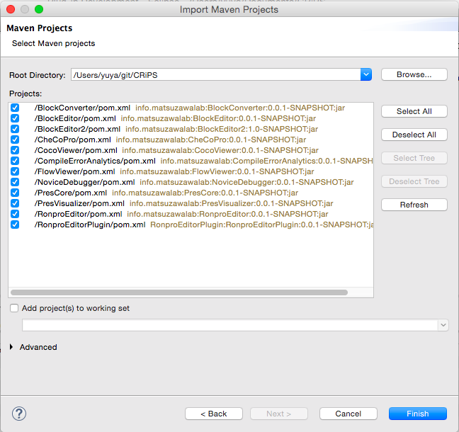

CRiPS
=====
## Requirements
- [Xtend Eclipse Plugin](http://www.eclipse.org/xtend/download.html) (if you want to edit this project using Eclipse.)
- [commonlibrary](https://github.com/macc704/commonlibrary)
- [Junicoen](https://github.com/macc704/Junicoen)

## How to Import
1. Import > Maven > Existing Maven Projects
1. Browse... > Choose CRiPS > Finish
1. Repeat same procedure for commonlibrary and Junicoen

